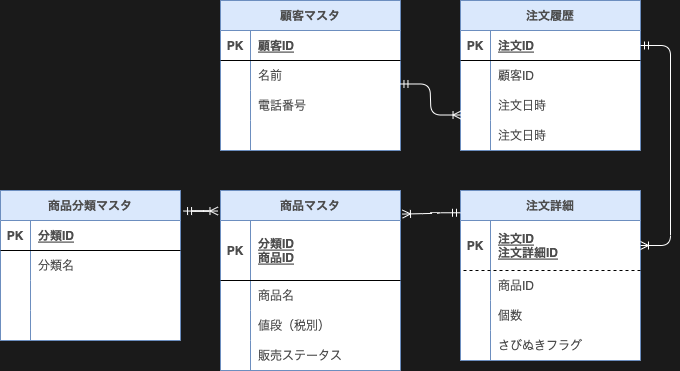
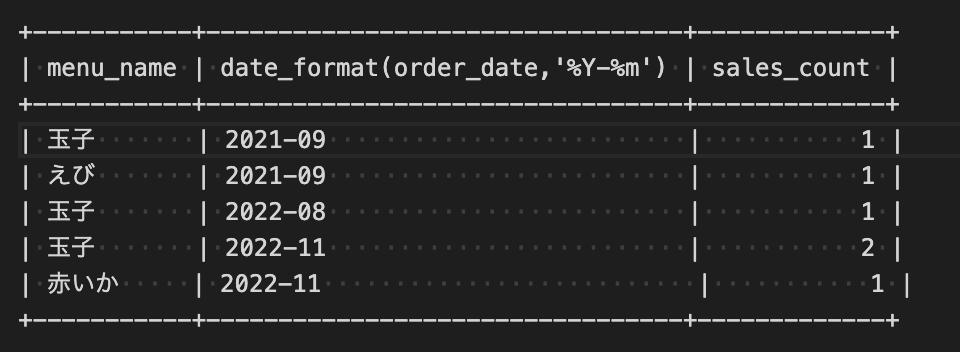

# 課題1
## ER図

## 各テーブルについて
- 注文詳細
  - 注文日時　こちらにもあった方がいいか迷ってなしに
  - さびぬきフラグ：0=通常(さびあり) 1=さびぬきなど
  - 注文でえび（さびあり）×2皿　えび（さびぬき）×1皿の場合、注文詳細としては2レコードとなる
- 商品分類マスタ
  - セットメニューの「盛り込み」「にぎり」「丼＆おすすめ」「地元に生まれた味」と「お好みすし」
  - 最初はセットメニューの分類テーブルも作成していたが、これくらいのバリエーションならいったん不要と思い削除
- 商品マスタ
  - 販売ステータス：商品としては存在するが現在注文できないものとの判別用に　0=未販売 1=販売中など
## その他気になっていること
  - 省略したが、各テーブルに追加・更新日時があるといい
  - 論理削除想定のため、削除フラグも

## 論理モデル・物理モデル
  - 論理モデル
    - 3層スキーマ（外部・概念・内部）のうち概念スキーマにあたる
    - エンティティの抽出・定義・正規化を行い２次元の表形式に整理　→　ER図の作成まで
    - 開発関係者からみたデータベースを、物理モデルに落とし込む前段階まで整理されたもの
  - 物理モデル
    - 3層スキーマのうち内部スキーマにあたる
    - DDL、インデックス、HWサイズなど、実際のデータベースの管理について定義されたもの

# 課題2

## 変更点
- 注文詳細
  - しゃりサイズを追加
  - ふつうをデフォルトとする
  - 0=ふつう、1=少なめなど
- メモ
  - しゃりサイズ、2パターン以上はありえるか？
    - はま寿司
      - 普通・半分の2種類
    - くら寿司
      - 同じく普通・ハーフの2種類
      - 以前はしゃり抜き（野菜）もあった
      - https://youpouch.com/2017/08/29/456070/
    - →寿司というサイズの特性として、抜き・ハーフ・普通の多くても3パターンほどと考えられる　セットメニューや丼も同様
  - 一つのネタの注文で、さびぬき・あり、しゃりふつう・少なめの4パターンある場合、注文詳細が4レコードになるがそれは設計上問題ないのか？他の考え方があれば知りたい

## 寿司ネタ売上集計
おそらく今の設計で取得できるため変更は不要と考える

> select menu_name,date_format(order_date,'%Y-%m'),count(*) as 'sales_count'
> from order_detail
> inner join order_history using (order_id)
> inner join menu using(category_id,menu_id)
> where category_id = 1 and order_status_flg = 1
> group by date_format(order_date,'%Y-%m'),menu_id
> order by date_format(order_date,'%Y-%m');

# 課題3

## 追加仕様
  - 出前の考慮
    - 住所や郵便番号の追加が必要
    - Aamzonで自宅住所以外にも配達ができることを考えると、顧客マスタの住所に届けるとは限らないため実際に届ける住所は注文履歴に持つべきかも
    - 注文履歴に決済方法があるといいかも
  - 優待セールで１週間だけ10%オフ（メニューはそのまま）
  - ポイントカード
  - メニューの追加
    - ex. 飲み物や汁物など
  - ~~注文履歴、注文詳細は論理削除想定（注文後のキャンセルなど~~
  - キャンセルやっぱり論理削除じゃなくてステータスで判断の方が良さそう
  - セットメニューの「盛り込み」「にぎり」：お好みすしの組み合わせで構成されている場合、単にお好みすしの商品ID、個数を保持するテーブルでメニューの組み合わせを実現できるようにする？
# 課題4
