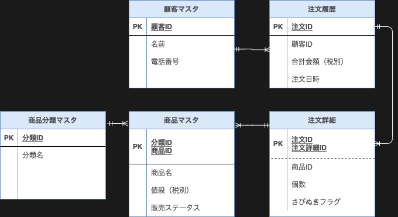

# 課題1
## ER図

## 各テーブルについて
- 顧客マスタ
  - 今回は「持ち帰りメニュー」なのであまり考慮はいらないが、出前が可能になったら住所や郵便番号の追加が必要
  - Aamzonで自宅住所以外にも配達ができることを考えると、顧客マスタの住所に届けるとは限らないため実際に届ける住所は注文履歴に持つべきかも
- 注文履歴
  - 決済方法があるといいかも
- 注文詳細
  - さびぬきフラグ：0=通常(さびあり) 1=さびぬきなど
  - 注文でえび（さびあり）×2皿　えび（さびぬき）×1皿の場合、注文詳細としては2レコードとなる
- 商品分類マスタ
  - セットメニューの「盛り込み」「にぎり」「丼＆おすすめ」「地元に生まれた味」と「お好みすし」
  - 最初はセットメニューの分類テーブルも作成していたが、これくらいのバリエーションならいったん不要と思い削除
- 商品マスタ
  - 販売ステータス：商品としては存在するが現在注文できないものとの判別用に　0=未販売 1=販売中など
----
- その他
  - 注文履歴、注文詳細は論理削除想定（注文後のキャンセルなど）
  - 省略したが、各テーブルに更新日時（＋更新ユーザID）は必要
  - セットメニューの「盛り込み」「にぎり」：お好みすしの組み合わせで構成されている場合、単にお好みすしの商品ID、個数を保持するテーブルでメニューの組み合わせを実現できるようにする？

#課題2